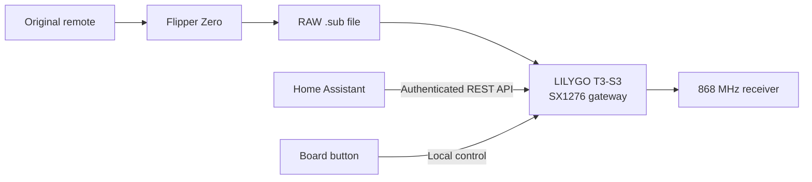

# LILYGO T3-S3 Flipper 868 Gateway

[Polska wersja README](README_PL.md)

> **Local replay of verified Flipper Zero RAW 2-FSK signals at 868 MHz, with web and Home Assistant control.**



Firmware that turns a LILYGO T3-S3 with an SX1276 868 MHz radio into a small, permanently powered signal gateway. It imports compatible Flipper Zero Sub-GHz RAW files, stores them in 16 persistent slots numbered `0` through `15`, and replays them from the local web interface, Home Assistant, or the board button.

Author and maintainer: **Bartosz Supcziński** — <bartek@env.pl>

Release history is available in [CHANGELOG.md](CHANGELOG.md).

## Why this project exists

Flipper Zero can replay the required 868 MHz signal reliably, but it is not intended to be a fixed Home Assistant gateway. Common low-cost 433 MHz OOK transmitters cannot reproduce the asynchronous 2-FSK waveform used here. This project uses the SX1276 direct modulation input so a verified Flipper capture can be replayed by a dedicated Wi-Fi device without keeping the Flipper installed.

The firmware deliberately implements only the required path. It is not a spectrum analyser, a general LoRa gateway, or a universal Sub-GHz decoder.

## Flipper format compatibility

| Signal file | Import | Replay |
| --- | :---: | :---: |
| SubGhz RAW with `FuriHalSubGhzPreset2FSKDev476Async` | Yes | Yes |
| Frequency from 863 to 870 MHz | Yes | Yes |
| Other 2-FSK presets | No | No |
| OOK/ASK RAW or decoded protocols | No | No |
| LoRa packets | No | No |
| Rolling-code generation | No | No |

The frequency is read independently from every imported file. The firmware preserves the signed RAW timing stream and sends it directly through SX1276 DIO2 with bit synchronization disabled. Short waveform sections are protected from task jitter, while long inter-frame gaps remain interruptible.

## What this project provides

### Signal storage and transmission

- 16 persistent signal slots, numbered `0` through `15`.
- Import and validation of compatible Flipper `.sub` files up to 64 KiB.
- Transactional slot replacement, so an invalid or interrupted upload does not replace a working signal.
- Per-file frequency and signed RAW timing preservation.
- Adjustable outer repetition count from 1 to 10 and a 0–2000 ms gap.
- SX1276 `PA_BOOST` transmission at the maximum configured output of **+20 dBm**.
- Two tested ZAMEL captures in [examples](examples/).

The included captures already contain four frames. Start with one outer repetition; additional repetitions resend the complete file.

### Local web interface

- Live radio, storage, network, selected-slot, and last-result status.
- Signal import, test transmission, normal transmission, and slot clearing.
- Wi-Fi configuration and browser-based OTA update.
- HTTP Digest authentication with an editable login and password.
- A private browser session after successful authentication, preventing repeated password prompts from background requests.
- Persistent OLED enable and orientation controls.

### OLED and local button

- 128×64 SSD1306 status display with automatic blanking after 60 seconds.
- The board-mounting orientation is the default; the web checkbox applies an additional 180-degree rotation.
- OLED power state and orientation survive a restart.
- Short button press: select the next occupied slot.
- Button press from 0.7 to 3 seconds: transmit the selected slot once.
- Button press longer than 3 seconds: show firmware and network information.

Disabling the OLED keeps it off during normal operation, button handling, and transmission.

### Wi-Fi recovery

When a running device loses Wi-Fi:

1. It immediately enters the disconnected state.
2. It attempts reconnection every 15 seconds.
3. After 60 seconds it restarts the Wi-Fi interface, web server, and mDNS state.
4. It continues reconnecting every 15 seconds.
5. After five minutes of uninterrupted loss it restarts the ESP32-S3.

A successful connection at any stage clears the recovery timer. After startup, failure to join the saved network within 20 seconds enables the `LILYGO-868-SETUP` access point. The device still retries the saved network every 15 seconds and leaves setup mode automatically after connecting.

### Home Assistant control

The optional package in [home-assistant](home-assistant/) provides:

- one parameterized REST command for any slot;
- 16 entity buttons for slots `0` through `15`;
- one REST switch for OLED power.

No receiver or household-device mapping is hard-coded. Rename or use the slot buttons in Home Assistant scripts, scenes, automations, and template entities as required.

## Hardware and pin assignment

This project was developed and tested on **LILYGO T3-S3 with ESP32-S3 and SX1276 868 MHz**. Attach an antenna designed for 868 MHz before powering or transmitting. Do not transmit without an antenna.

| Function | GPIO |
| --- | ---: |
| SX1276 SCK | 5 |
| SX1276 MISO | 3 |
| SX1276 MOSI | 6 |
| SX1276 CS | 7 |
| SX1276 RESET | 8 |
| SX1276 DIO0 | 9 |
| SX1276 DIO1 | 33 |
| SX1276 DIO2 direct DATA | 34 |
| OLED SDA | 18 |
| OLED SCL | 17 |
| Board button | 0 |
| Board LED | 37 |

The microSD slot is not used and a card is not required.

## Repository layout

| Path | Purpose |
| --- | --- |
| `src/main.cpp` | Device, radio, web, OLED, Wi-Fi recovery, and OTA logic |
| `src/flipper_parser.h` | Flipper RAW file parser and validation |
| `CHANGELOG.md` | Release history |
| `examples/` | Working ZAMEL RAW signal examples |
| `home-assistant/` | Optional Home Assistant package and example secrets |
| `partitions.csv` | ESP32-S3 OTA and LittleFS partition table |
| `platformio.ini` | Reproducible PlatformIO environment and pinned libraries |

## Release files

Each GitHub release provides three matching assets:

- `*.factory.bin` for the first USB installation;
- `*.ota.bin` for later web updates;
- `SHA256SUMS.txt` for verifying both firmware images.

GitHub automatically generates the source `.zip` and `.tar.gz` archives. The project does not upload a duplicate source archive.

## Requirements

- LILYGO T3-S3 with SX1276 for the 868 MHz band.
- A correctly fitted 868 MHz antenna.
- A USB-C cable supporting data for first installation or recovery.
- A 2.4 GHz Wi-Fi network.
- Chrome or Edge for browser-based USB installation.
- Home Assistant only if network automation is required.
- PlatformIO Core only when building from source.

## 1. First installation

Use the merged `*.factory.bin` file only for the initial USB installation:

1. Connect the 868 MHz antenna.
2. Connect the board with a USB-C data cable.
3. Open [ESPHome Web](https://web.esphome.io/) in Chrome or Edge.
4. Select the board serial port and choose **Install**.
5. Select `lilygo-t3-s3-flipper-868-gateway-1.0.2.factory.bin`.
6. Wait for the board to restart.

Only if the browser cannot initialize the board, hold **BOOT**, tap **RESET**, release **BOOT**, and reconnect. This is a recovery procedure, not a normal update step.

## 2. Configure Wi-Fi and web access

1. Join the `LILYGO-868-SETUP` Wi-Fi network.
2. Enter the setup access-point password: `lilygo868`.
3. Open `http://192.168.4.1/` and save the home Wi-Fi credentials.
4. After reconnection, open `http://lilygo-868.local/` or the address assigned by the router.
5. Sign in with the initial web credentials: `admin` / `lilygo868`.
6. Open **Login & password** and set unique credentials.

The setup access point is intentionally available without web authentication after joining it, so network access can be recovered. Its WPA2 password is fixed in firmware.

## 3. Import and test a signal

1. Confirm that **LIVE DEVICE STATUS** reports `storage ready` and `radio ready`.
2. Select a target slot from `0` to `15`.
3. Enter a descriptive signal name.
4. Select a compatible Flipper `.sub` file.
5. Choose **IMPORT & TEST**.
6. Leave **File repetitions** at `1` for the supplied ZAMEL examples.

Import validates the file before replacing the selected slot. A rejected upload leaves the previous slot contents intact.

## 4. Configure Home Assistant

Copy the package to the Home Assistant packages directory:

```bash
scp home-assistant/lilygo_868_gateway.yaml \
  root@HOME_ASSISTANT_IP:/var/lib/homeassistant/packages/
```

Copy the two keys from `home-assistant/secrets.example.yaml` into Home Assistant's `secrets.yaml` and replace them with the web credentials configured on the gateway:

```yaml
lilygo_868_username: "your-login"
lilygo_868_password: "your-password"
```

If mDNS is unavailable, replace `lilygo-868.local` in the package with a reserved IP address. Check the Home Assistant configuration before restarting it.

The parameterized action can be called directly:

```yaml
action: rest_command.lilygo_868_send_slot
data:
  slot: 0
  repeats: 1
  gap_ms: 100
```

## 5. Install later firmware updates

Open `http://lilygo-868.local/update`, select the `*.ota.bin` file, and keep power connected until the device restarts. Do not upload the `*.factory.bin` file on the OTA page.

## 6. Build from source

Install PlatformIO Core, clone the repository, and build the application:

```bash
git clone https://github.com/supczinskib/lilygo-t3-s3-flipper-868-gateway.git
cd lilygo-t3-s3-flipper-868-gateway
pio run
```

The pinned environment uses Espressif32 platform `6.12.0`, RadioLib `7.7.1`, and the ThingPulse SSD1306 library `4.6.1`. PlatformIO writes the OTA application image to `.pio/build/lilygo_t3_s3_sx1276/firmware.bin`.

## REST API examples

All normal API calls require the configured web credentials:

```bash
curl --digest -u 'LOGIN:PASSWORD' -X POST \
  'http://lilygo-868.local/api/send?slot=0&repeats=1&gap_ms=100'

curl --digest -u 'LOGIN:PASSWORD' \
  'http://lilygo-868.local/api/status'
```

## Security

- Change the initial web login and password after installation.
- The web interface uses HTTP Digest authentication but does not provide HTTPS transport encryption.
- Keep the gateway on a trusted local network and do not expose port 80 directly to the public Internet.
- Use a VPN for remote access.
- Home Wi-Fi credentials and changed web credentials are stored only in the device's NVS partition; they are not present in the source, factory image, OTA image, or example configuration.
- The example ZAMEL RAW captures are intentionally public operational signal data, not account credentials.

## Troubleshooting

### The device does not appear after installation

Check the USB cable, try another USB port, and use the BOOT/RESET recovery sequence only if normal browser initialization fails.

### The web page or Home Assistant cannot reach the gateway

Try the reserved IP address instead of `lilygo-868.local`. Automatic Wi-Fi recovery cannot correct a wrong SSID/password or missing 2.4 GHz coverage; use `LILYGO-868-SETUP` to update the network configuration.

### A file is rejected

Confirm that it is a Flipper SubGhz RAW file using `FuriHalSubGhzPreset2FSKDev476Async`, that its frequency is between 863 and 870 MHz, and that it is smaller than 64 KiB.

### Transmission succeeds in the UI but the receiver does not react

Verify the antenna, selected slot, capture frequency, signal preset, and distance. Start with one outer repetition. The firmware cannot convert unsupported presets or generate rolling codes.

### Verify release files

Download both firmware images and `SHA256SUMS.txt` from the same GitHub release into one directory, then run:

```bash
sha256sum -c SHA256SUMS.txt
```
