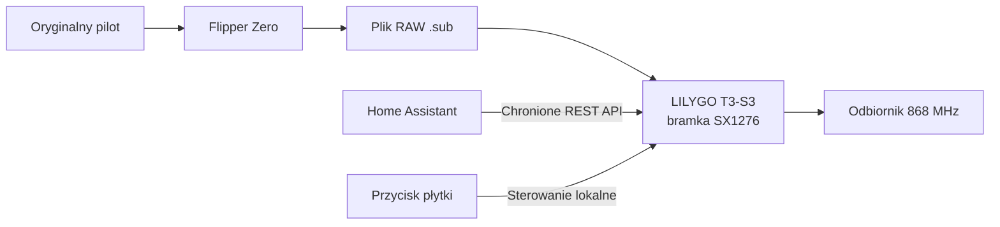

# LILYGO T3-S3 Flipper 868 Gateway

[English README](README.md)

> **Lokalne odtwarzanie sprawdzonych sygnałów RAW 2-FSK z Flipper Zero na 868 MHz, sterowane przez WWW i Home Assistant.**



Firmware zmienia LILYGO T3-S3 z radiem SX1276 868 MHz w niewielką, stale zasilaną bramkę sygnałów. Importuje zgodne pliki RAW Sub-GHz z Flipper Zero, zapisuje je w 16 trwałych slotach numerowanych od `0` do `15` i odtwarza z lokalnej strony WWW, Home Assistant albo przyciskiem płytki.

Autor i opiekun projektu: **Bartosz Supcziński** — <bartek@env.pl>

Historia wydań znajduje się w pliku [CHANGELOG.md](CHANGELOG.md).

## Po co powstał ten projekt

Flipper Zero niezawodnie odtwarza wymagany sygnał 868 MHz, ale nie jest urządzeniem przeznaczonym do stałej pracy jako bramka Home Assistant. Popularne, tanie nadajniki OOK 433 MHz nie potrafią odtworzyć używanego tutaj asynchronicznego przebiegu 2-FSK. Ten projekt wykorzystuje bezpośrednie wejście modulacji SX1276, dzięki czemu sprawdzone przechwycenie z Flippera może odtwarzać dedykowane urządzenie Wi-Fi.

Firmware celowo realizuje tylko potrzebną ścieżkę. Nie jest analizatorem widma, ogólną bramką LoRa ani uniwersalnym dekoderem Sub-GHz.

## Zgodność z formatami Flippera

| Plik sygnału | Import | Odtwarzanie |
| --- | :---: | :---: |
| SubGhz RAW z `FuriHalSubGhzPreset2FSKDev476Async` | Tak | Tak |
| Częstotliwość od 863 do 870 MHz | Tak | Tak |
| Inne presety 2-FSK | Nie | Nie |
| RAW OOK/ASK lub protokoły zdekodowane | Nie | Nie |
| Pakiety LoRa | Nie | Nie |
| Generowanie kodów zmiennych | Nie | Nie |

Częstotliwość jest odczytywana niezależnie z każdego importowanego pliku. Firmware zachowuje znaki i czasy RAW, a następnie przekazuje przebieg bezpośrednio przez DIO2 SX1276 przy wyłączonej synchronizacji bitów. Krótkie fragmenty przebiegu są chronione przed opóźnieniami zadań, a długie przerwy między ramkami nie blokują przerwań.

## Funkcje projektu

### Pamięć i nadawanie sygnałów

- 16 trwałych slotów sygnałów, numerowanych od `0` do `15`.
- Import i walidacja zgodnych plików `.sub` Flippera do 64 KiB.
- Transakcyjna zamiana zawartości slotu — błędny lub przerwany import nie zastąpi działającego sygnału.
- Częstotliwość oraz przebieg RAW zachowane osobno dla każdego pliku.
- Zewnętrzna liczba powtórzeń od 1 do 10 i odstęp 0–2000 ms.
- Nadawanie SX1276 przez `PA_BOOST` z maksymalną skonfigurowaną mocą **+20 dBm**.
- Dwa sprawdzone przechwycenia ZAMEL w katalogu [examples](examples/).

Dołączone przechwycenia zawierają już po cztery ramki. Zacznij od jednego zewnętrznego powtórzenia; większa wartość ponownie wysyła cały plik.

### Lokalna strona WWW

- Bieżący stan radia, pamięci, sieci, wybranego slotu oraz wynik ostatniej operacji.
- Import, transmisja testowa, zwykła transmisja i kasowanie slotów.
- Konfiguracja Wi-Fi i aktualizacja OTA przez przeglądarkę.
- Uwierzytelnianie HTTP Digest ze zmiennym loginem i hasłem.
- Prywatna sesja przeglądarki po poprawnym logowaniu, która eliminuje wielokrotne pytania o hasło przy zapytaniach w tle.
- Trwałe sterowanie zasilaniem i orientacją OLED.

### OLED i przycisk lokalny

- Wyświetlacz SSD1306 128×64 z automatycznym wygaszeniem po 60 sekundach.
- Domyślna orientacja odpowiada montażowi płytki; pole na stronie WWW stosuje dodatkowy obrót o 180 stopni.
- Stan zasilania i orientacja OLED są zachowywane po restarcie.
- Krótkie naciśnięcie przycisku: wybór kolejnego zajętego slotu.
- Naciśnięcie od 0,7 do 3 sekund: jednokrotne wysłanie wybranego slotu.
- Naciśnięcie dłuższe niż 3 sekundy: informacje o firmware i sieci.

Wyłączenie OLED pozostawia ekran wyłączony podczas normalnej pracy, obsługi przycisku i transmisji.

### Odzyskiwanie Wi-Fi

Gdy działające urządzenie utraci Wi-Fi:

1. Natychmiast rozpoczyna pomiar czasu braku połączenia.
2. Co 15 sekund ponawia próbę połączenia.
3. Po 60 sekundach restartuje interfejs Wi-Fi, serwer WWW i stan mDNS.
4. Nadal próbuje połączyć się co 15 sekund.
5. Po pięciu minutach nieprzerwanej utraty sieci restartuje ESP32-S3.

Udane połączenie na dowolnym etapie zeruje licznik. Jeżeli podczas startu urządzenie nie połączy się z zapisaną siecią w ciągu 20 sekund, uruchamia punkt `LILYGO-868-SETUP`. Nadal co 15 sekund próbuje połączyć się z siecią domową i automatycznie wyłącza tryb konfiguracyjny po uzyskaniu połączenia.

### Sterowanie z Home Assistant

Opcjonalny pakiet w katalogu [home-assistant](home-assistant/) udostępnia:

- jedno parametryzowane polecenie REST dla dowolnego slotu;
- 16 przycisków encji dla slotów od `0` do `15`;
- jeden przełącznik REST zasilania OLED.

Mapowanie odbiorników i urządzeń domowych nie jest zapisane na stałe. Przyciski slotów można zmienić nazwą albo wykorzystać w skryptach, scenach, automatyzacjach i encjach szablonowych Home Assistant.

## Sprzęt i przypisanie pinów

Projekt powstał i został sprawdzony na **LILYGO T3-S3 z ESP32-S3 oraz SX1276 868 MHz**. Przed podłączeniem zasilania i nadawaniem zamontuj antenę przeznaczoną dla 868 MHz. Nie nadawaj bez anteny.

| Funkcja | GPIO |
| --- | ---: |
| SX1276 SCK | 5 |
| SX1276 MISO | 3 |
| SX1276 MOSI | 6 |
| SX1276 CS | 7 |
| SX1276 RESET | 8 |
| SX1276 DIO0 | 9 |
| SX1276 DIO1 | 33 |
| SX1276 DIO2 — bezpośrednie DATA | 34 |
| OLED SDA | 18 |
| OLED SCL | 17 |
| Przycisk płytki | 0 |
| Dioda płytki | 37 |

Slot microSD nie jest używany i karta nie jest potrzebna.

## Układ repozytorium

| Ścieżka | Przeznaczenie |
| --- | --- |
| `src/main.cpp` | Urządzenie, radio, WWW, OLED, odzyskiwanie Wi-Fi i OTA |
| `src/flipper_parser.h` | Parser i walidacja plików RAW Flippera |
| `CHANGELOG.md` | Historia wydań |
| `examples/` | Działające przykładowe sygnały RAW ZAMEL |
| `home-assistant/` | Opcjonalny pakiet Home Assistant i przykładowe sekrety |
| `partitions.csv` | Tablica partycji ESP32-S3 dla OTA i LittleFS |
| `platformio.ini` | Powtarzalne środowisko PlatformIO i przypięte wersje bibliotek |

## Pliki wydania

Każde wydanie GitHub zawiera trzy pasujące do siebie pliki:

- `*.factory.bin` do pierwszej instalacji przez USB;
- `*.ota.bin` do kolejnych aktualizacji przez WWW;
- `SHA256SUMS.txt` do sprawdzenia obu obrazów firmware.

GitHub automatycznie generuje archiwa źródeł `.zip` i `.tar.gz`. Projekt nie dołącza drugiego, zduplikowanego archiwum źródeł.

## Wymagania

- LILYGO T3-S3 z SX1276 dla pasma 868 MHz.
- Prawidłowo zamontowana antena 868 MHz.
- Przewód USB-C obsługujący dane do pierwszego wgrania lub odzyskiwania.
- Sieć Wi-Fi 2,4 GHz.
- Chrome albo Edge do instalacji przez USB z przeglądarki.
- Home Assistant tylko wtedy, gdy potrzebna jest automatyzacja sieciowa.
- PlatformIO Core tylko do kompilacji ze źródeł.

## 1. Pierwsze wgranie

Scalonego pliku `*.factory.bin` używaj tylko do pierwszej instalacji przez USB:

1. Podłącz antenę 868 MHz.
2. Połącz płytkę przewodem USB-C obsługującym dane.
3. Otwórz [ESPHome Web](https://web.esphome.io/) w Chrome albo Edge.
4. Wybierz port szeregowy płytki i kliknij **Install**.
5. Wskaż `lilygo-t3-s3-flipper-868-gateway-1.0.2.factory.bin`.
6. Poczekaj na restart płytki.

Tylko jeśli przeglądarka nie potrafi zainicjować płytki, przytrzymaj **BOOT**, krótko naciśnij **RESET**, zwolnij **BOOT** i połącz się ponownie. Jest to procedura awaryjna, a nie zwykły etap aktualizacji.

## 2. Konfiguracja Wi-Fi i dostępu WWW

1. Połącz się z siecią `LILYGO-868-SETUP`.
2. Wpisz hasło punktu konfiguracyjnego: `lilygo868`.
3. Otwórz `http://192.168.4.1/` i zapisz dane domowej sieci Wi-Fi.
4. Po połączeniu otwórz `http://lilygo-868.local/` albo adres przydzielony przez router.
5. Zaloguj się początkowymi danymi: `admin` / `lilygo868`.
6. Otwórz **Login & password** i ustaw unikalne dane dostępowe.

Po dołączeniu do punktu konfiguracyjnego strona ustawień sieci jest celowo dostępna bez uwierzytelniania WWW, aby można było odzyskać łączność. Sam punkt jest chroniony stałym hasłem WPA2 zapisanym w firmware.

## 3. Import i test sygnału

1. Sprawdź, czy **LIVE DEVICE STATUS** pokazuje `storage ready` i `radio ready`.
2. Wybierz docelowy slot od `0` do `15`.
3. Wpisz czytelną nazwę sygnału.
4. Wskaż zgodny plik `.sub` Flippera.
5. Kliknij **IMPORT & TEST**.
6. Dla dołączonych przykładów ZAMEL pozostaw **File repetitions** równe `1`.

Import sprawdza plik przed zmianą zawartości slotu. Odrzucony plik nie usuwa wcześniejszego, działającego sygnału.

## 4. Konfiguracja Home Assistant

Skopiuj pakiet do katalogu pakietów Home Assistant:

```bash
scp home-assistant/lilygo_868_gateway.yaml \
  root@ADRES_HOME_ASSISTANT:/var/lib/homeassistant/packages/
```

Skopiuj dwa klucze z `home-assistant/secrets.example.yaml` do pliku `secrets.yaml` Home Assistant i wpisz dane WWW ustawione w bramce:

```yaml
lilygo_868_username: "twoj-login"
lilygo_868_password: "twoje-haslo"
```

Jeżeli mDNS nie działa, zamień `lilygo-868.local` w pakiecie na zarezerwowany adres IP. Przed restartem Home Assistant sprawdź poprawność konfiguracji.

Parametryzowaną akcję można wywołać bezpośrednio:

```yaml
action: rest_command.lilygo_868_send_slot
data:
  slot: 0
  repeats: 1
  gap_ms: 100
```

## 5. Kolejne aktualizacje firmware

Otwórz `http://lilygo-868.local/update`, wskaż plik `*.ota.bin` i nie odłączaj zasilania do restartu urządzenia. Na stronie OTA nie używaj pliku `*.factory.bin`.

## 6. Kompilacja ze źródeł

Zainstaluj PlatformIO Core, sklonuj repozytorium i skompiluj aplikację:

```bash
git clone https://github.com/supczinskib/lilygo-t3-s3-flipper-868-gateway.git
cd lilygo-t3-s3-flipper-868-gateway
pio run
```

Środowisko używa platformy Espressif32 `6.12.0`, RadioLib `7.7.1` oraz biblioteki ThingPulse SSD1306 `4.6.1`. PlatformIO zapisuje obraz aplikacji OTA jako `.pio/build/lilygo_t3_s3_sx1276/firmware.bin`.

## Przykłady REST API

Zwykłe wywołania API wymagają skonfigurowanych danych WWW:

```bash
curl --digest -u 'LOGIN:HASLO' -X POST \
  'http://lilygo-868.local/api/send?slot=0&repeats=1&gap_ms=100'

curl --digest -u 'LOGIN:HASLO' \
  'http://lilygo-868.local/api/status'
```

## Bezpieczeństwo

- Po instalacji zmień początkowy login i hasło WWW.
- Strona używa HTTP Digest, ale nie zapewnia szyfrowania transportu HTTPS.
- Używaj bramki w zaufanej sieci lokalnej i nie wystawiaj portu 80 bezpośrednio do Internetu.
- Do dostępu zdalnego używaj VPN.
- Dane domowego Wi-Fi i zmienione dane WWW są przechowywane wyłącznie w partycji NVS urządzenia; nie występują w źródłach, obrazie factory, obrazie OTA ani konfiguracji przykładowej.
- Przykładowe sygnały RAW ZAMEL pozostawiono celowo jako publiczne dane operacyjne; nie są danymi konta ani sieci.

## Rozwiązywanie problemów

### Urządzenie nie pojawia się po instalacji

Sprawdź przewód USB, użyj innego portu i zastosuj procedurę BOOT/RESET tylko wtedy, gdy zwykła inicjalizacja z przeglądarki nie działa.

### Strona WWW lub Home Assistant nie widzi bramki

Użyj zarezerwowanego adresu IP zamiast `lilygo-868.local`. Automatyczne odzyskiwanie Wi-Fi nie naprawi błędnego SSID, błędnego hasła ani braku zasięgu 2,4 GHz; w takim przypadku zmień konfigurację przez `LILYGO-868-SETUP`.

### Plik jest odrzucany

Sprawdź, czy jest to plik Flipper SubGhz RAW z presetem `FuriHalSubGhzPreset2FSKDev476Async`, częstotliwością od 863 do 870 MHz i rozmiarem mniejszym niż 64 KiB.

### Strona potwierdza transmisję, ale odbiornik nie reaguje

Sprawdź antenę, wybrany slot, częstotliwość przechwycenia, preset i odległość. Zacznij od jednego zewnętrznego powtórzenia. Firmware nie konwertuje nieobsługiwanych presetów i nie generuje kodów zmiennych.

### Sprawdzenie plików wydania

Pobierz oba obrazy firmware oraz `SHA256SUMS.txt` z tego samego wydania GitHub do jednego katalogu, a następnie uruchom:

```bash
sha256sum -c SHA256SUMS.txt
```
